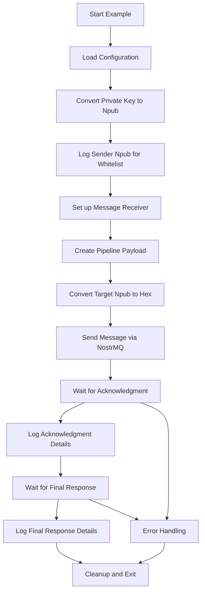

# SendToPipe.js Example - Architecture Plan

## Overview

Create a new NostrMQ example that demonstrates triggering a remote AI agent in the pipeliner service. This example will follow the established patterns from existing examples while implementing the specific pipeline-trigger payload format.

## Requirements Analysis

Based on the obsidian documentation, the example needs to:

1. **Log sender npub** - Display the npub representation for whitelist verification
2. **Create pipeline message** - Format the NostrMQ message according to the pipeline spec
3. **Send to target** - Send to `npub1qjldns0md8kputcf05aumas9zy44hv3vnxn969r5ky4ur9e6s9esh2509k`
4. **Handle responses** - Log both acknowledgment and final response

## Target Configuration

- **Target npub**: `npub1qjldns0md8kputcf05aumas9zy44hv3vnxn969r5ky4ur9e6s9esh2509k`
- **Sender private key**: `f8cb6c8b2184e0c195063e4dee13c96c7fa5e1fe5c6a4a94a6d7460964074550` (from .env)
- **Sender npub**: _Need to convert from private key_

## Pipeline Payload Specification

### Required Message Format

```json
{
  "type": "pipeline-trigger",
  "pipeline": "dialogue",
  "parameters": {
    "sourceText": "Artificial Intelligence is rapidly transforming various industries, from healthcare to finance. While AI offers tremendous potential for improving efficiency and solving complex problems, it also raises concerns about job displacement, privacy, and ethical decision-making.",
    "discussionPrompt": "What are the most significant opportunities and challenges that AI presents for society, and how should we approach AI development responsibly?",
    "iterations": 3,
    "summaryFocus": "Summarize the key opportunities and challenges discussed, along with any recommendations for responsible AI development."
  },
  "requestId": "dialogue-request-001",
  "options": {
    "priority": "normal"
  }
}
```

### Expected Response Pattern

**1. Immediate Acknowledgment:**

```json
{
  "type": "pipeline-ack",
  "jobId": "job_abc123",
  "status": "accepted",
  "message": "Pipeline execution started",
  "requestId": "dialogue-request-001"
}
```

**2. Completion Response:**

```json
{
  "type": "pipeline-response",
  "jobId": "job_abc123",
  "status": "completed",
  "requestId": "dialogue-request-001",
  "result": {
    "runId": "pipeline_xyz789",
    "conversation": [...],
    "summary": {...},
    "files": {...}
  },
  "executionTime": 120.5
}
```

## Implementation Architecture

### File Structure

- **Location**: `examples/sendToPipe.js`
- **Pattern**: Follow `basic-usage.js` structure with pipeline-specific modifications

### Key Components

1. **Imports and Setup**

   - Import `send`, `receive` from NostrMQ
   - Import `nip19` for npub conversion
   - Load configuration

2. **Sender Identification**

   - Convert private key to public key
   - Convert public key to npub format
   - Log npub for whitelist verification

3. **Message Construction**

   - Build pipeline-trigger payload
   - Include all required parameters
   - Generate unique requestId

4. **Message Sending**

   - Convert target npub to hex format
   - Send message using NostrMQ
   - Log send confirmation

5. **Response Handling**

   - Set up receiver for responses
   - Handle acknowledgment message
   - Wait for and log final response
   - Implement timeout handling

6. **Error Handling**
   - Graceful error handling
   - Proper cleanup on shutdown
   - Informative error messages

### Code Flow Diagram



## Implementation Steps

1. **Setup and Configuration**

   - Create basic file structure
   - Import required dependencies
   - Load environment configuration

2. **Key Conversion Utility**

   - Convert private key to public key
   - Convert public key to npub format
   - Log for whitelist verification

3. **Message Receiver Setup**

   - Configure receiver for pipeline responses
   - Implement response type routing
   - Add logging for both ack and final responses

4. **Pipeline Message Creation**

   - Build the exact payload format required
   - Include all mandatory fields
   - Generate unique request ID

5. **Message Transmission**

   - Convert target npub to hex format
   - Send via NostrMQ with proper error handling
   - Log transmission details

6. **Response Processing**

   - Wait for acknowledgment
   - Process and log acknowledgment details
   - Wait for final response with timeout
   - Process and log final response details

7. **Cleanup and Error Handling**
   - Implement graceful shutdown
   - Add comprehensive error handling
   - Ensure proper resource cleanup

## Testing Strategy

1. **Whitelist Verification**

   - Run example to get sender npub
   - Verify npub is whitelisted on pipeliner service

2. **Message Format Validation**

   - Ensure payload matches exact specification
   - Verify all required fields are present

3. **Response Handling**

   - Test acknowledgment reception
   - Test final response reception
   - Test timeout scenarios

4. **Error Scenarios**
   - Test with invalid target
   - Test with malformed payload
   - Test network failure scenarios

## Success Criteria

- [ ] Example successfully logs sender npub for whitelist verification
- [ ] Message is properly formatted according to pipeline specification
- [ ] Message is successfully sent to target npub
- [ ] Acknowledgment is received and logged with all details
- [ ] Final response is received and logged with all details
- [ ] Proper error handling and graceful shutdown
- [ ] Code follows established example patterns
- [ ] Comprehensive logging for debugging and verification

## Next Steps

1. Switch to orchestrator mode for implementation
2. Create the sendToPipe.js file
3. Implement key conversion utility
4. Build message receiver and sender logic
5. Test with actual pipeliner service
6. Refine based on testing results
